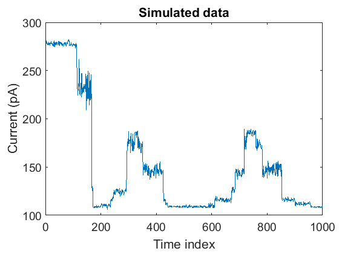
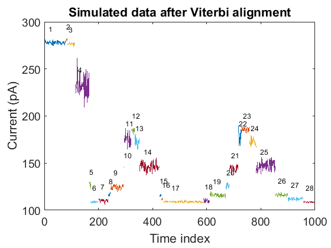

HMM
=======

## What

HMM is a class written in Matlab meant to simplify the usage of hidden Markov models to decode stateful processes in (possibly noisy) biological time-series data.

## Usage

See 'script.m' for a quick tour.

## Example data analysis

An example of what some raw biological time-series data might look like.  This simulates data from a nanopore current-versus-time recording.



Setting up the HMM object and typing the command

```matlab
>> hmm.viterbi
```

produces an output that can be plotted like so, denoting which hidden states each data point was assigned to.  There is no data pre-processing needed.  No level segmentation.  Just direct application of the Viterbi algorithm.


And finally, plotting the raw data points again, this time colored by their hidden state assignments, we see that the HMM has done a great job.  The simulated data were not generated from a Markov process explicitly.  The simulation only specified the order of states, and drew their durations from an exponential distrubution.



## Who

Stephen Fleming, PhD candidate in the Harvard Physics Department, working on nanopore DNA sequencing.  2018.
